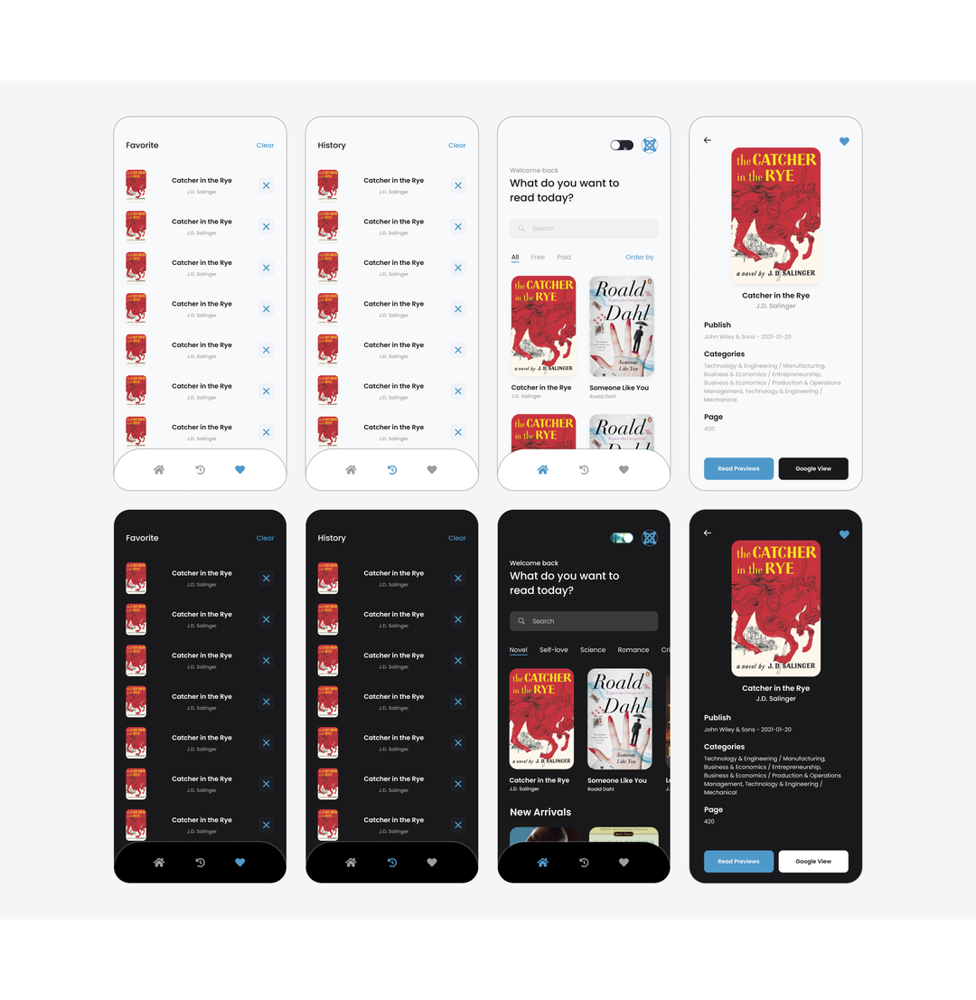

# MinhTC Books App



- MinhTC Books is a mobile application built with React Native, Redux, and Expo. It allows users to browse and discover a collection of books. The app provides features like searching for books, viewing book details, and managing a personal reading list via Google Books API.
- Video demo: https://youtu.be/zREfIsxbSCM
- Please give this source a star, thank you so much 🥰.

## Installation

1. Clone the repository or download the source code.
2. Navigate to the project directory.
3. Install the dependencies using npm:

```shell
npm install
```

## Usage

To start the app on various platforms, use the following npm scripts:

- Start the app on Android:

```shell
npm run android
```

- Start the app on iOS:

```shell
npm run ios
```

- Start the app on the web:

```shell
npm run web
```

## Features

- Browse and search for books.
- View book details, including title, author, description, and cover image.
- Add books to a personal reading list.
- Persist reading list data using AsyncStorage.
- Seamless navigation between screens using React Navigation.

## Dependencies

- React Native
- Redux
- React Redux
- Redux Persist
- Redux Thunk
- Expo
- Expo App Loading
- Expo Font
- Expo Status Bar
- Expo WebView
- React Navigation
- React Native Gesture Handler
- React Native Async Storage
